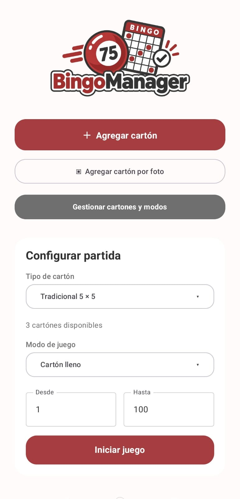
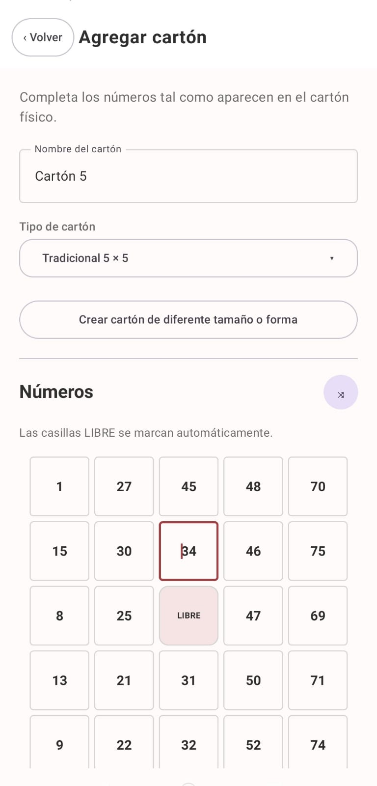
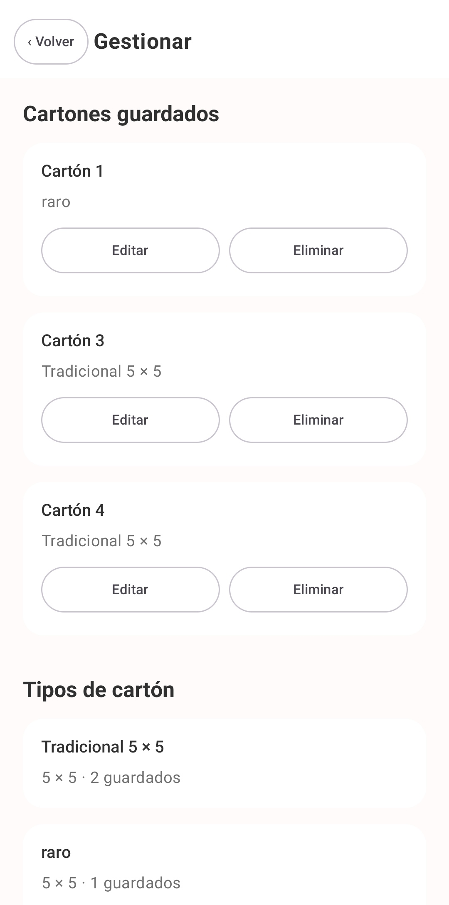
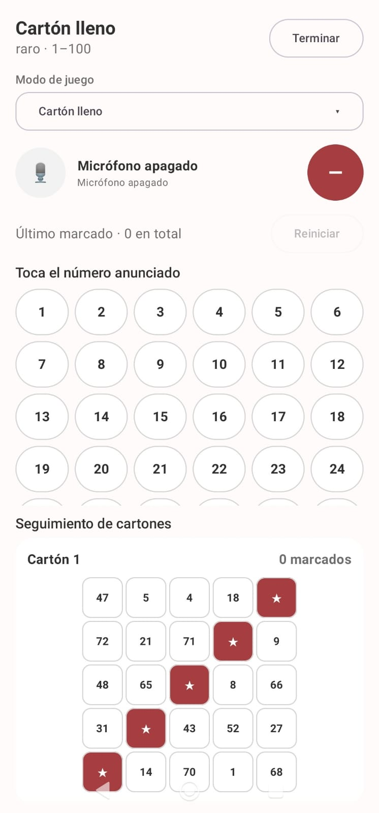
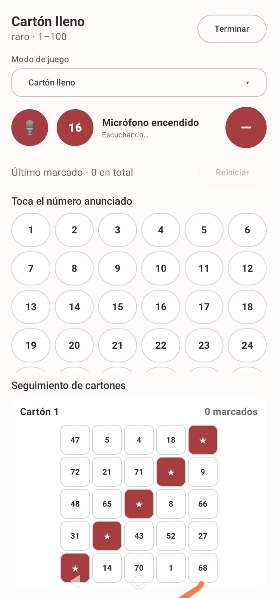
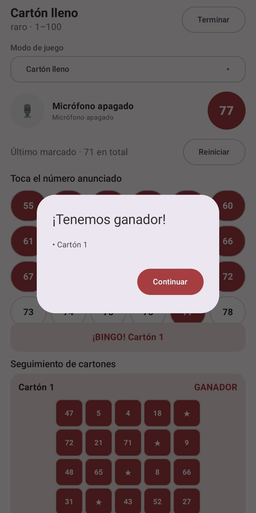

# BingoManager

<p align="center">
  
</p>

Asistente Android para administrar cartones de bingo físicos y detectar ganadores en tiempo real. Toda la información de cartones y partidas se guarda localmente en el teléfono, sin cuentas ni servidores propios. El micrófono prefiere el reconocimiento local y puede usar el servicio de voz del teléfono como alternativa.

## APK de prueba

Puedes descargar e instalar la versión de demostración desde [`resultados/BingoManager-debug.apk`](resultados/BingoManager-debug.apk). Es una compilación de depuración para pruebas; Android puede solicitar permiso para instalar aplicaciones desde esta fuente.

## Arquitectura MVC

El proyecto está separado para que el recorrido del código sea fácil de seguir:

- `model/`: datos puros (`BingoCard`, `BingoTemplate`, `GameMode`) y reglas para decidir cuándo un cartón gana.
- `data/`: lectura y escritura local en `SharedPreferences`, usando JSON.
- `controller/`: recibe las acciones de las pantallas, valida datos, actualiza modelos y coordina la persistencia.
- `view/`: pantallas de Jetpack Compose. Muestran estado y delegan las acciones al controlador.

El flujo normal es:

`Vista → BingoController → Modelo/Reglas → BingoRepository → almacenamiento local`

## Funciones incluidas

- Cartón tradicional de 5 × 5 con centro libre.
- Plantillas personalizadas de 1 × 1 hasta 20 × 20.
- Celdas numéricas, libres o desactivadas para crear formas irregulares.
- Edición y eliminación de cartones, plantillas y modos personalizados.
- Persistencia después de cerrar la aplicación.
- Cámara integrada, recorte manual previo e importación por foto con reconocimiento de texto local mediante ML Kit.
- Botón compacto de llenado aleatorio para probar rápidamente el editor de cartones.
- Partidas separadas por tipo de cartón: nunca se mezclan tamaños.
- Rango configurable; por defecto 1–75, y se conserva el último rango utilizado.
- Cartón lleno, fila, columna, diagonal, 2/3/4 esquinas, X, L, T, marco y modos rápidos de 1/2/3 números.
- Figuras ganadoras personalizadas.
- Cambio del modo de juego sin abandonar la partida.
- Micrófono opcional: prefiere el reconocimiento local, cambia automáticamente al servicio de voz del teléfono si hace falta, propone el número escuchado y solo lo marca cuando el usuario confirma la bolita.
- Marcado en vivo de todos los cartones y aviso inmediato de ganadores.

## Logo

El logo provisional está en `app/src/main/res/drawable-nodpi/bingo_manager_logo.png`. Para reemplazarlo, conserva el mismo nombre de archivo o cambia la referencia `R.drawable.bingo_manager_logo` en `HomeScreen.kt`.

## Verificación

Desde la raíz del proyecto:

```powershell
.\gradlew.bat testDebugUnitTest
.\gradlew.bat assembleDebug lintDebug
```

El APK de desarrollo queda en `app/build/outputs/apk/debug/app-debug.apk`.

## Capturas de pantalla

<table>
  <tr>
    <td align="center"><br><sub><b>Menú principal</b></sub></td>
    <td align="center"><br><sub><b>Agregar un cartón</b></sub></td>
  </tr>
  <tr>
    <td align="center"><br><sub><b>Agregar por foto</b></sub></td>
    <td align="center"><br><sub><b>Gestionar cartones</b></sub></td>
  </tr>
  <tr>
    <td align="center"><br><sub><b>Partida en curso</b></sub></td>
    <td align="center"><br><sub><b>Reconocimiento por micrófono</b></sub></td>
  </tr>
  <tr>
    <td colspan="2" align="center"><br><sub><b>Aviso de ganador</b></sub></td>
  </tr>
</table>
